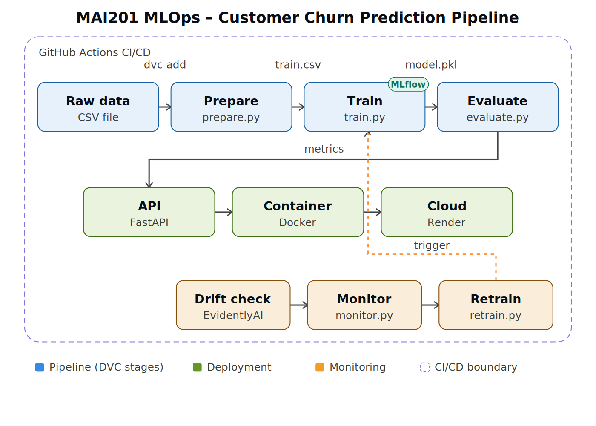

# MAI201 MLOps - Customer Churn Prediction

Predicts which telecom customers are likely to cancel their subscription.
Phase 1 covers the dataset, architecture, DVC pipeline, and MLflow experiment tracking.

**Team:** Group 2 | Seneca Polytechnic | Summer 2026 | Instructor: Asma Azim

---

## Team

| Member | Role | Phase 1 Tasks |
|---|---|---|
| Devreet Kaur | ML Lead | EDA notebook, train.py, MLflow experiments 1 and 2, tech stack docs |
| Arushi Anand | Engineering Lead | Architecture diagram, dataset docs, evaluate.py, MLflow experiment 3 |
| Cha Li | Project + Docs Lead | prepare.py, DVC setup, dvc.yaml, reproducibility testing |

---

## Dataset

### Source and Overview

| Property | Value |
|---|---|
| Name | Telco Customer Churn |
| Source | [Kaggle - IBM Telco Customer Churn](https://www.kaggle.com/datasets/blastchar/telco-customer-churn) |
| Origin | IBM synthetic dataset. Publicly available, no privacy/licensing constraints. |
| Size | 7,043 rows × 21 columns (~955 KB) |
| Target variable | `Churn`: binary (`Yes` / `No`), encoded to `1` / `0` in `prepare.py` |
| Class balance | 73.5% No Churn / 26.5% Churned (moderate imbalance) |

### Features (20 total, + target)

| Category | Features |
|---|---|
| Demographic (4) | `gender`, `SeniorCitizen`, `Partner`, `Dependents` |
| Account (4) | `tenure`, `Contract`, `PaperlessBilling`, `PaymentMethod` |
| Billing (2) | `MonthlyCharges`, `TotalCharges` |
| Services (10) | `PhoneService`, `MultipleLines`, `InternetService`, `OnlineSecurity`, `OnlineBackup`, `DeviceProtection`, `TechSupport`, `StreamingTV`, `StreamingMovies` |
| Identifier (dropped) | `customerID` - unique per row, no predictive value |

After encoding in prepare.py, the 20 input features become 26 columns:
- 4 numeric kept as-is: tenure, MonthlyCharges, TotalCharges, SeniorCitizen
- 12 binary Yes/No columns label-encoded to 0/1 (one column each)
- 10 one-hot encoded columns from 3 multi-category features:
  InternetService (3 values = 3 columns), Contract (3 values = 3 columns),
  PaymentMethod (4 values = 4 columns)
Total: 4 + 12 + 10 = 26 feature columns

### Data Quality Assessment

| Check | Finding | Action Taken |
|---|---|---|
| **Missing values** | `TotalCharges` is stored as a string; 11 rows have a blank value (all customers with `tenure = 0`, i.e. brand-new accounts not yet billed) | `pd.to_numeric(errors='coerce')` then `fillna(0.0)` in `prepare.py` |
| **Duplicates** | 0 duplicate rows found (`df.duplicated().sum() == 0`) | No action needed |
| **Outliers** | Numeric ranges: `tenure` 0–72 months, `MonthlyCharges` $18.25–$118.75, `TotalCharges` up to $8,684.80. Distributions are right-skewed but reflect real long-tenure/high-usage customers rather than data errors, no values fall outside plausible telecom billing ranges, so no rows were removed. `StandardScaler` is applied in `train.py` to control for the wide value ranges rather than treating them as outliers to drop. | None removed; scaled instead |
| **Type issues** | `TotalCharges` read as `object` instead of `float64` | Converted in `prepare.py` |
| **Identifier leakage risk** | `customerID` has no predictive signal and could act as a memorization shortcut | Dropped in `prepare.py` |

### Class Imbalance

26.5% churn rate is moderate, not severe. Rather than resampling (SMOTE), the pipeline uses `class_weight='balanced'` in both Logistic Regression and Random Forest, and prioritizes ROC-AUC and churn recall over raw accuracy, accuracy alone is misleading here since predicting "No Churn" for every row would already score ~73.5%.

### Train / Validation / Test Split

70% / 15% / 15%, stratified on `Churn` to preserve the 26.5% rate in every split (`prepare.py`, `random_state=42` for reproducibility). The test set is held out and touched only once, in `evaluate.py`, for final reporting.

### Key EDA Findings

| Feature | Finding |
|---|---|
| Contract type | Month-to-month customers churn at 42.7% vs 2.8% for two-year contracts |
| Tenure | New customers (0-12 months) churn at 47.7%, long-term at 9.5% |
| Internet service | Fiber optic customers churn at 41.9% vs 19.0% for DSL |
| Monthly charges | Churned customers pay $13/month more on average |
| Pearson correlation | No feature exceeds 0.95 correlation with Churn -- no leakage detected |
| Strongest predictor | Contract_Month-to-month (r = 0.41) |
| Weakest predictor | gender (r = 0.009) |

### Data Versioning (DVC)

The raw CSV and every processed split are tracked with DVC rather than committed to Git directly:

```bash
dvc add data/raw/WA_Fn-UseC_-Telco-Customer-Churn.csv
dvc remote add -d myremote s3://mlops-mai102-dvc/dvcdata
dvc remote modify myremote region us-east-2
# Add your credentials locally (never commit these):
dvc remote modify --local myremote access_key_id 'YOUR_KEY'
dvc remote modify --local myremote secret_access_key 'YOUR_SECRET'
dvc push
```

This keeps the Git repo lightweight while still giving every team member and the CI pipeline an identical, reproducible copy of the data via `dvc pull`. The `prepare` stage in `dvc.yaml` regenerates `data/processed/{train,val,test}.csv` and `feature_columns.json` automatically whenever the raw file or `prepare.py` changes.

---
## Architecture



The pipeline runs left to right: raw data is versioned and cleaned (`prepare.py`), trained with MLflow experiment tracking (`train.py`), scored on the held-out test set (`evaluate.py`), then served via FastAPI, containerized with Docker, and deployed to Render. A monitoring loop (EvidentlyAI drift checks) watches the deployed model in production and can trigger retraining. GitHub Actions runs the pipeline and tests on every push.

---
## Technology Stack

| Tool | Why we chose it |
|---|---|
| scikit-learn | Logistic Regression and Random Forest models. Simple, well-documented, and fast for this dataset size. |
| DVC | Versions data files and defines the pipeline. dvc repro re-creates any result from scratch. |
| MLflow | Logs every experiment run with its parameters, metrics, and model so runs can be compared. |
| FastAPI | Serves predictions as a REST API. Auto-generates interactive docs at /docs. |
| Docker | Packages the API into a container so it runs identically on any machine or cloud. |
| GitHub Actions | Runs tests on every push. Blocks deployment if any test fails. |
| EvidentlyAI | Detects when production data drifts from training data and flags retraining. |

**Deployment strategy:** Batch on-demand. A customer record is sent as a POST request to the /predict endpoint and a churn probability is returned.

---
## Experiment Results

| Run | Model | ROC-AUC | Recall | F1 | Accuracy |
|---|---|---|---|---|---|
| 1 (baseline) | Logistic Regression | 0.8449 | 0.8143 | 0.6255 | 0.7415 |
| 2 | Random Forest (200/10) | 0.8398 | 0.7464 | 0.6372 | 0.7746 |
| 3 | Random Forest (300/15) | 0.8276 | 0.5893 | 0.5967 | 0.7888 |

Performance targets: ROC-AUC >= 0.84 and Churn Recall >= 0.70.
Best model: Logistic Regression (Experiment 1) -- meets both targets.

---
## Final Test Set Metrics

Evaluated by `evaluate.py` on the held-out test set (never touched during training):

| Metric | Value |
|---|---|
| Accuracy | 0.7919 |
| Precision | 0.6287 |
| Recall | 0.5302 |
| F1 Score | 0.5753 |
| ROC-AUC | 0.8259 |

## What Is Not Committed to Git

These files exist locally or in DVC/S3 but are never committed to the Git repo:

| File / Folder | Reason | Where it lives |
|---|---|---|
| `data/raw/*.csv` | Raw data tracked by DVC | AWS S3 via `dvc pull` |
| `data/processed/*.csv` | Generated by `prepare.py` | Reproduced via `dvc repro` |
| `models/model.pkl` | Generated by `train.py` | Reproduced via `dvc repro` |
| `models/scaler.pkl` | Generated by `train.py` | Reproduced via `dvc repro` |
| `reports/plots/*.png` | Generated by `evaluate.py` | Reproduced via `dvc repro` |
| `reports/metrics_test.json` | Generated by `evaluate.py` | Tracked as DVC metric |
| `mlruns/` | Local MLflow tracking folder | Machine-specific |
| `mlflow.db` | Local MLflow SQLite database | Machine-specific |
| `.dvc/config.local` | S3 credentials | Never leave your machine |


## How to Run

```bash
# 1. Clone the repo
git clone https://github.com/lalala6506/MAI201.git
cd MAI201

# 2. Activate your conda environment
conda activate your-env-name

# 3. Install dependencies
pip install -r requirements.txt

# 4a. Set your S3 credentials locally (get these from your team lead)
dvc remote modify --local myremote access_key_id 'YOUR_KEY'
dvc remote modify --local myremote secret_access_key 'YOUR_SECRET'

# 4b. Pull data from DVC remote
dvc pull

# 5. Run the full pipeline (prepare, train, evaluate)
dvc repro

# 6. View metrics
dvc metrics show

# 7. Compare experiments in MLflow
mlflow ui --port 5001 --backend-store-uri sqlite:///mlflow.db
# Open http://localhost:5001
# Note: port 5000 is blocked on macOS by AirPlay Receiver
```
